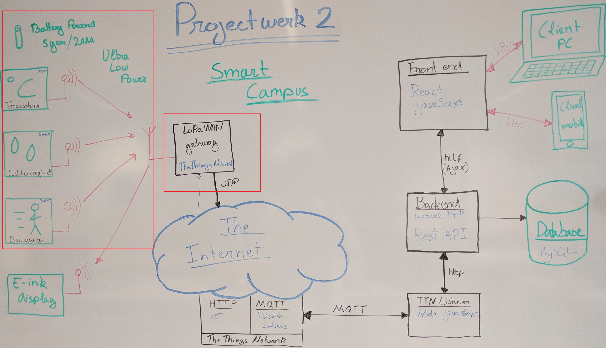
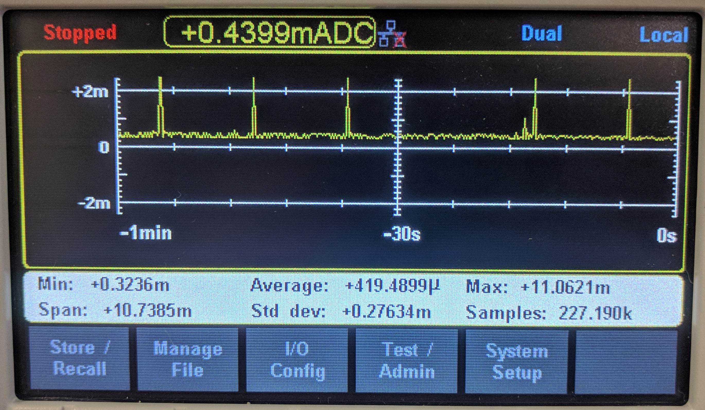
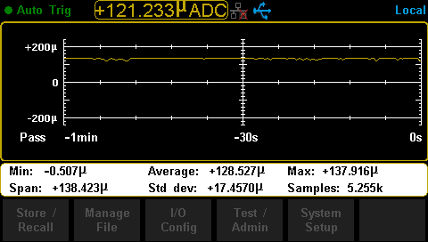
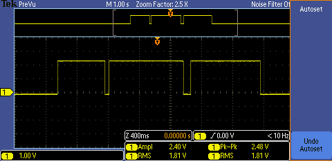

# Projectwork - Smart Campus

## Measurements

We measured the current of the Lorwan and the PIR-sensor.
Down there you can see the oscilloscope images.

### Lorawan

As you can see there is an issue with the package that are send. Sometimes the IC sends a package avery 20 seconds, but it must be avery 10 seconds.

### PIR-sensor

The average current of the PIR is about 128 µA.

When you apply the power to the sensor it will take about 4.140 seconds to startup. This pattern will always be the same. 

Afterwards the out will be zero if there is no movement. Otherwise you'll see pulses by every movement. Some pulses are longer than others. Because the sensor sees more movement or the object comes closer to the sensor.

 

 When the PIR registers a movement, the output will generate a pulse.